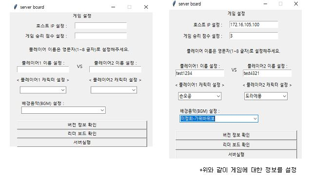
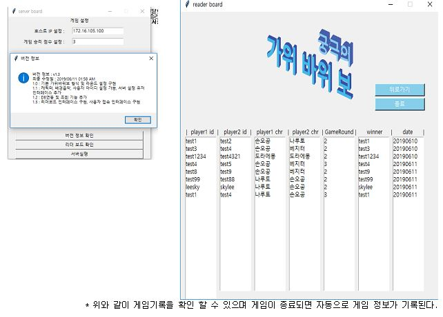
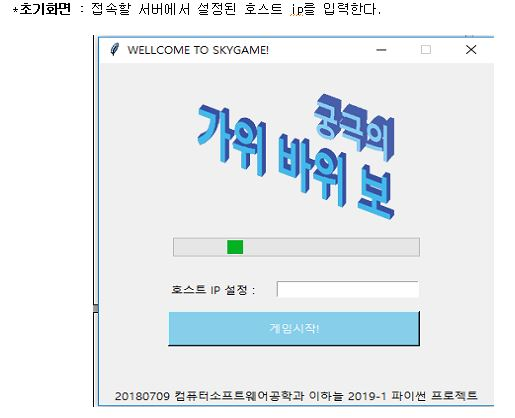
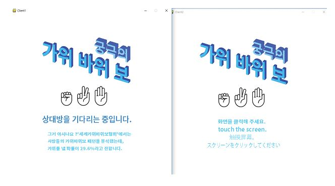
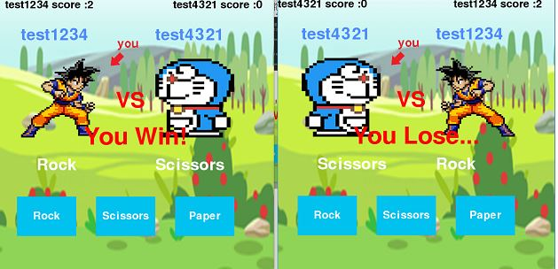

# Python_Online-rock-paper-scissors

**This project is a remote rock-paper-scissors game using Python socket programming.**

####  dev environment & Stack(Including modules, packages, and libraries)
| Purpose | Name | Remarks |
|:---:|:---:|:---:|
|Interpreter | Python3 | 3.6|
| GUI | `tkinter` `pygame` | - 정적UI - 음악,배경,사용자이벤트 |
|DataBase|sqlite3|데이터베이스|
|통신|`pickle` `socket`| - 직렬화 및 역직렬화 - 소켓통신
|기타|`datetime`| 현 표준 시간 받아오기
|개발환경| PyCharm | IDE
|멀티쓰레드|`_thread`| row level thread

#### executable file

| fileName |  |
|------------|----------|
| `server.py` | <ul><li>서버 ip 설정</li><li>게임 승리 점수 설정</li><li>플레이어1, 플레이어2 이름 설정</li><li>플레이어1, 플레이어2 캐릭터 설정</li><li>배경음악 설정</li><li>버전 정보 확인</li><li>리더보드(게임 기록) 저장 및 조회</li><li>설정한 정보를 각 클라이언트에게 전달</li><li>각 클라이언트의 게임 내 정보를 연결하기 위해 클라이언트와 데이터 수신 및 송신</li><li>객체 단위로 통신하기 위해 직렬화 및 역직렬화 구현</li></ul> |
| `client.py` | <ul><li>서버 ip 입력하여 서버에 접속</li><li>상대방이 접속할 때까지 대기</li><li>서버로부터 생성된 게임에 대한 정보를 소켓을 통해 받아옴</li><li>가위바위보UI 렌더링 및 게임진행</li><li>설정된 라운드 수 만큼 게임을 진행하고, 승자의 정보를 소켓을 통해 서버로 넘기고 5초후에 종료된다.</li></ul> | 

- 소켓을 통해 서버로 승자에 대한 정보가 전달되면, 미리 구현해놓은 데이터베이스에 게임정보(player의 ID 및 캐릭터 정보, 설정된 승리 라운드 수, 게임이 진행된 날짜(서버에서 datetime 모듈을 통해 받아온다), 승리자)를 저장한다.

#### In Game

**server.py** 
    
   

**client.py** 
    
    
   

#### 참고자료

**origin source**

    - https://techwithtim.net/tutorials/python-online-game-tutorial/client/

**socket**

    1. 바인딩
         - https://vinetomcat.tistory.com/entry/binding%EC%9D%B4%EB%9E%80
    2. 기본연결
         - https://soooprmx.com/archives/8737
         - https://docs.python.org/3/library/socket.html

**pygame**

    - https://kkamikoon.tistory.com/129
    - https://blog.naver.com/PostView.nhn?blogId=samsjang&logNo=220713309790&proxyReferer=https%3A%2F%2Fwww.google.com%2F
    - https://studioplug.tistory.com/194
    - https://futurestorys.tistory.com/102
    - https://yoonkh.github.io/python/2017/12/10/brain7.html

**_thread**

    - https://bloodguy.tistory.com/entry/thread-%EC%82%AC%EC%9A%A9%EB%B2%95

**tkinter**

    - https://m.blog.naver.com/PostView.nhn?blogId=infoefficien&logNo=221057243324&proxyReferer=https%3A%2F%2Fwww.google.com%2F 
    - http://blog.naver.com/PostView.nhn?blogId=audiendo&logNo=220791080634&categoryNo=27&parentCategoryNo=0&viewDate=&currentPage=1&postListTopCurrentPage=1&from=postView
    - https://076923.github.io/posts/Python-tkinter-6/

